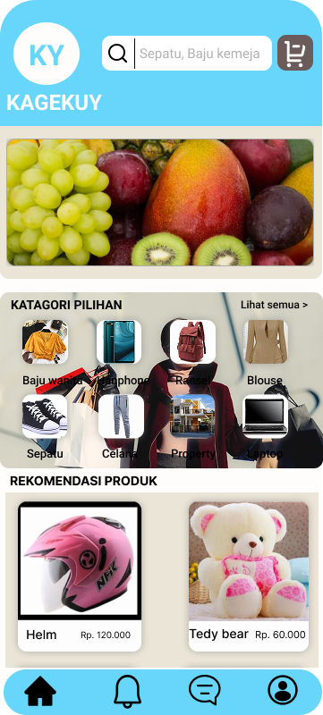
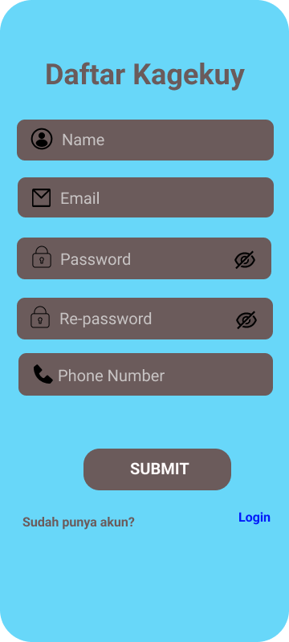

# UI/UX Design — Kagekuy E-commerce Mobile App

Designed a mobile e-commerce app for online shopping, covering 
the complete user journey from product browsing to checkout. 
Focused on creating an intuitive shopping experience with clear 
product categorization and a simple checkout flow.

## Key Screens
- Home & Product Catalog
- Login
- Sign Up
- Product Detail
- Shopping Cart

## Tools
- Figma

## Design Preview
[View Full Design on Figma](https://www.figma.com/design/FhhonlPqooDk7lGE5ijGkr/Final-Exam-Apk-Mobile?node-id=0-1&t=mHTrJDmXGJYDbhru-1)

## Screenshots

